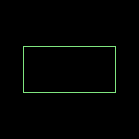
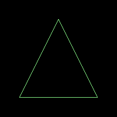
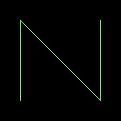
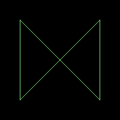
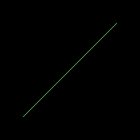
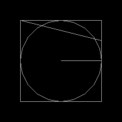
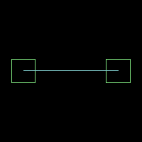

# KTX: `Box2D` physics engine utilities

Utilities and type-safe builders for the default LibGDX 2D physics engine: *Box2D*.

### Why?

*Box2D* API, being a direct port from C++, can be difficult to work with - especially for beginners. Bodies and fixtures
construction code readability could certainly be improved. Kotlin type-safe builing DSL can help with that.

### Guide

`ktx-box2d` provides some extensions and utilities that aim improve *Box2D* API:

- `createWorld` factory method eases the construction of `World` instances.
- `World.body` and `Body` extension methods provide `Fixture` type-safe building DSL that supports customizing fixtures
with the following shapes:
  - `box`:`PolygonShape` as a box.
  - `circle`: `CircleShape`.
  - `polygon`: `PolygonShape`.
  - `chain`: `ChainShape`.
  - `loop`: looped `ChainShape`.
  - `edge`: looped `EdgeShape`.
  - `fixture`: a custom `Shape` passed as parameter.
- `FixtureDef.filter` extension methods aim to simplify `Filter` API usage.
- `Body` was extended with the following builder methods that ease creation of `Joint` instances:
  - `gearJointWith`: `GearJoint`.
  - `ropeJointWith`: `RopeJoint`.
  - `weldJointWith`: `WeldJoint`.
  - `motorJointWith`: `MotorJoint`.
  - `mouseJointWith`: `MouseJoint`.
  - `wheelJointWith`: `WheelJoint`.
  - `pulleyJointWith`: `PulleyJoint`.
  - `distanceJointWith`: `DistanceJoint`.
  - `frictionJointWith`: `FrictionJoint`.
  - `revoluteJointWith`: `RevoluteJoint`.
  - `prismaticJointWith`: `PrismaticJoint`.
  - `jointWith`: any `Joint` type supported by the custom `JointDef` passed as the method argument.
- `earthGravity` is a constant that roughly matches Earth's gravity.

### Usage examples

Creating a new Box2D `World` without gravity:

```Kotlin
import ktx.box2d.createWorld

val world = createWorld()
```

Creating a new Box2D `World` with a custom gravity:

```Kotlin
import ktx.box2d.createWorld
import ktx.box2d.earthGravity
import com.badlogic.gdx.math.Vector2

val world = createWorld(gravity = Vector2(0f, -10f))

val earth = createWorld(gravity = earthGravity)
```

Creating a `Body` with a `PolygonShape` box `Fixture`:

```Kotlin
import ktx.box2d.body


// Building body from scratch:
val body = world.body {
  box(width = 2f, height = 1f) {
    density = 40f
  }
}

// Adding box polygon fixture to an existing body:
val fixture = body.box(width = 2f, height = 1f) {
  density = 40f
}
```




Creating a `Body` with a custom `PolygonShape` `Fixture`:

```Kotlin
import ktx.box2d.body
import com.badlogic.gdx.math.Vector2

// Building body from scratch:
val body = world.body {
  polygon(Vector2(-1f, -1f), Vector2(0f, 1f), Vector2(1f, -1f)) {
    density = 40f
  }
}

// Adding polygon fixture to an existing body:
val fixture = body.polygon(Vector2(-1f, -1f), Vector2(0f, 1f), Vector2(1f, -1f)) {
  density = 40f
}
```



Creating a `Body` with a `CircleShape` `Fixture`:

```Kotlin
import ktx.box2d.body

// Building body from scratch:
val body = world.body {
  circle(radius = 1f) {
    restitution = 0.5f
  }
}

// Adding circle fixture to an existing body:
val fixture = body.circle(radius = 1f) {
  restitution = 0.5f
}
```


Creating a `Body` with a `ChainShape` `Fixture`:

```Kotlin
import ktx.box2d.body
import com.badlogic.gdx.math.Vector2

// Building body from scratch:
val body = world.body {
  chain(Vector2(-1f, -1f), Vector2(-1f, 1f), Vector2(1f, -1f), Vector2(1f, 1f)) {
    friction = 0.5f
  }
}

// Adding chain fixture to an existing body:
val fixture = body.chain(Vector2(-1f, -1f), Vector2(-1f, 1f), Vector2(1f, -1f), Vector2(1f, 1f)) {
  friction = 0.5f
}
```



Creating a `Body` with a looped `ChainShape` `Fixture`:

```Kotlin
import ktx.box2d.body
import com.badlogic.gdx.math.Vector2

// Building body from scratch:
val body = world.body {
  loop(Vector2(-1f, -1f), Vector2(-1f, 1f), Vector2(1f, -1f), Vector2(1f, 1f)) {
    friction = 0.5f
  }
}

// Adding looped chain fixture to an existing body:
val fixture = body.loop(Vector2(-1f, -1f), Vector2(-1f, 1f), Vector2(1f, -1f), Vector2(1f, 1f)) {
  friction = 0.5f
}
```



Creating a `Body` with an `EdgeShape` `Fixture`:

```Kotlin
import ktx.box2d.body
import com.badlogic.gdx.math.Vector2

// Building body from scratch:
val body = world.body {
  edge(from = Vector2(-1f, -1f), to = Vector2(1f, 1f)) {
    restitution = 1f
  }
}

// Adding edge fixture to an existing body:
val fixture = body.edge(from = Vector2(-1f, -1f), to = Vector2(1f, 1f)) {
  restitution = 1f
}
```



Creating a dynamic `Body` with multiple `Fixture` instances:

```Kotlin
import ktx.box2d.*
import com.badlogic.gdx.math.Vector2
import com.badlogic.gdx.physics.box2d.BodyDef.BodyType.DynamicBody

val body = world.body {
  type = DynamicBody
  circle(radius = 1f) {
    restitution = 0.5f
    filter {
      categoryBits = 0x01
      maskBits = 0x02
    }
  }
  box(width = 2f, height = 2f) {
    density = 40f
  }
  edge(from = Vector2(-1f, 1f), to = Vector2(1f, 0.5f)) {
    friction = 0.7f
  }
}
```



Customizing `Shape` of a `Fixture`:

```Kotlin
import ktx.box2d.*

val body = world.body {
  // Shapes are available as the default `it` parameter of fixture
  // building blocks. Of course, they can be renamed - in this
  // example we renamed the CircleShape parameter to `shape`:
  circle { shape ->
    shape.radius = 0.5f
    shape.position = Vector2(0.5f, 0.5f)
  }
}
```


Creating two `Body` instances joined with a `DistanceJoint`:

```Kotlin
import ktx.box2d.*

val bodyA = world.body {
  position.set(-1f, 0f)
  box(width = 0.5f, height = 0.5f) {}
}
val bodyB = world.body {
  position.set(1f, 0f)
  box(width = 0.5f, height = 0.5f) {}
}
// Extension methods for all other joint types are also available.
val joint = bodyA.distanceJointWith(bodyB) {
  length = 2f
}
```



Adding callbacks invoked after creation of `Body` and `Fixture` instances:

```Kotlin
import ktx.box2d.*

val body = world.body {
  onCreate { body ->
    // Will be called when the body and all of its fixtures are built.
  }

  circle {
    onCreate { fixture ->
      // Will be called when this particular fixture is created. Note
      // that at invocation time the Box2D body of this fixture might
      // not be fully constructed yet.
    }
  }
}
```

#### Synergy

Pair this library with [`ktx-math`](../math) for `Vector2` factory methods, operator overloads and other math-related
utilities.

### Alternatives

- [gdx-box2d-kotlin](https://github.com/Jkly/gdx-box2d-kotlin) is the first published Kotlin *Box2D* utilities library
that originally inspired `ktx-box2d`.
- [libgdx-utils-box2d](https://bitbucket.org/dermetfan/libgdx-utils) is a set of *Box2D* utilities written in Java.

#### Additional documentation

- [LibGDX *Box2D* article.](https://github.com/libgdx/libgdx/wiki/Box2d)
- [Official *Box2D* website.](http://box2d.org/)
