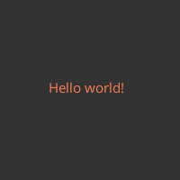
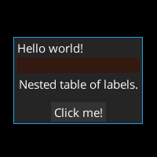
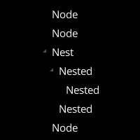
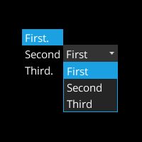

[](https://search.maven.org/artifact/io.github.libktx/ktx-scene2d)

# KTX: `Scene2D` type-safe builders

Utilities for creating `Scene2D` widgets using Kotlin type-safe builders.

### Why?

Building `Scene2D` GUIs in Java usually leads to overly verbose, complicated code. It is hard to reason about how it
will actually look on the screen. As opposed to HTML, XML or other easily readable markup languages, Java rarely forms
visually appealing GUI templates. Kotlin type-safe builders DSL is a great compromise between the two: readability of
a markup language meets flexibility and expressiveness of a programming language.

### Guide

`ktx-scene2d` provides a number of factory and extension methods that mimic the original `Scene2D` API, allowing you to
use Kotlin type-safe builder DSL. Methods were designed to match the original API as closely as possible.

All `ktx-scene2d` DSL methods that create Scene2D widgets match names of widget classes converted to lower camel case,
and contain similar parameters to widgets constructors. For example, you can use `label` method to construct a
`com.badlogic.gdx.scenes.scene2d.ui.Label`, passing a `CharSequence` (text of the label) and optional `Skin` and
`LabelStyle` name as parameters. If you are familiar with `Scene2D` API, `ktx-scene2d` should feel natural.

To access the Scene2D DSL, you can use the `scene2d` object:

```kotlin
import ktx.scene2d.*

val myFirstActor = scene2d.label(text = "Hello World!")
```

To avoid passing a custom `Skin` instance to create the actors, make sure to set the default `Skin` before building UIs:

```kotlin
import com.badlogic.gdx.scenes.scene2d.ui.Skin
import ktx.scene2d.*

fun setDefaultSkin() {
  Scene2DSkin.defaultSkin = Skin()
}
```

`scene2d` provides factory methods for all official Scene2D actors. These can be divided into the following groups:

* *Root* actors: these actors are usually added directly to a `Stage`:
  * `dialog`
  * `window`
* *Parent* actors - widgets that can have nested children:
  * Parental widgets that were _designed_ to store actors and control their layout:
    * `buttonTable`
    * `container`
    * `horizontalGroup`
    * `scrollPane`
    * `splitPane`
    * `stack`
    * `table`
    * `tree`
    * `verticalGroup`
  * Parental widgets that _can_ store actors due to their type hierarchy, but do not have to:
    * `button`
    * `checkBox`
    * `imageButton`
    * `imageTextButton`
    * `textButton`
* *Child* actors - basic Scene2D widgets that cannot have any children:
  * `image`
  * `label`
  * `listWidget`, `listWidgetOf`
  * `particleEffect`
  * `progressBar`
  * `selectBox`, `selectBoxOf`
  * `slider`
  * `textArea`
  * `textField`
  * `touchpad`

Additionally, `tooltip` and `textTooltip` extension methods were added to all actors to ease creation of tooltips.

When it comes to building user interfaces, you usually start with a single *parent* or *root* actor from the list above
and fill it with widgets:

```kotlin
import ktx.scene2d.*

scene2d.table {
  label("Hello world!")
}
```

The example above would create a `Table` instance with a single `Label` child.

All factory methods return instances of the created actors. If you need a direct reference to an actor, you can always
assign the result of the factory method:

```kotlin
import ktx.scene2d.*

val myRoot = scene2d.table {
  val myLabel = label("Hello world!")
  // myLabel is Label
}
// myRoot is Table
```

Actors also can be nested:

```kotlin
import ktx.scene2d.*

val myTable = scene2d.table {
  button {
    label("Click me.")
  }
}
```

The snippet above would create a `Table` instance with a single `Button` child containing a nested `Label`. There are no
practical nesting limits: as long as you do not manually set up circular references (actors being parents of themselves),
your widget hierarchies should *just work*.

Thanks to Kotlin's `@DslMarker`, you cannot implicitly access parents from within children blocks, which resolves most
scoping issues. For example, `Label` is not a `Group` and it cannot have children, so this code would not compile:

```kotlin
import ktx.scene2d.*

val myTable = scene2d.table {
  label("Not a real parent.") {
    label("Invalid.") // !!! Does not compile: outside the `table` scope.
  }
}
```

This ensures that the layout of your code will translate to the actual widgets hierarchy in the GUI.

While certainly less verbose than Java, this DSL would not be very useful without the possibility to customize
the widgets. Let's consider this example of widget customization written in Java:

```java
public Table createTableWithLabel(Skin skin) {
    Table table = new Table(skin);
    table.pad(4f);

    Label label = new Label("Example.", skin);
    label.setColor(Color.RED);

    table.add(label);

    return table;
}
```

Notice how you have to pass the `Skin` instance every time you want to create a new widget with a predefined style.
The widgets hierarchy is not clear at first glance, which only gets worse as more widgets are added. You have
to read through the code and find `add` calls to understand how the UI is built.

When to it comes to `ktx-scene2d`, widgets can be customized in the following ways:

* Method parameters: values necessary to construct the widgets can be passed as parameters.
* Building blocks: lambdas can be used along with the factory methods to customize the widgets.
Lambdas receive the widget as `this`, which makes it very simple to access widget properties.

For example:

```kotlin
val label = scene2d.label("Label text is a necessary parameter!") {
  this is Label // == true
  // You can customize your label here! Let's change the color of the label:
  color = Color.RED
}
```

Now, let's rewrite the previous Java customization example in Kotlin with `ktx-scene2D` DSL:

```kotlin
import ktx.scene2d.*
import com.badlogic.gdx.graphics.Color

val myTable = scene2d.table {
  pad(4f) // Setting table padding.

  label("Example.") {
    color = Color.RED // Setting label color.
  }
}
```

Not only is the hierarchy clearer - the `label` is clearly a child of the `table` - but also the settings are less
verbose to customize.

Building your code with Kotlin DSL is also safer. Actors hierarchy in your code is preserved and reflected in the UI.
You do not have to remember to add the `Label` to the `Table` explicitly, as the structure of your code already
dictates how and when the actors will be connected.

Also, you do not have to worry to accidentally changing properties of nested actors - Kotlin DSL capabilities prevent
that during compilation:

```kotlin
scene2d.table {
  label("This would not compile") {
    pad(4f) // !!! Compilation error: `pad` belongs to the `table`, not `label`.
  }
  pad(4f) // This is OK, as we are still in the `table` scope.
}
```

In the building blocks you have full access to the Scene2D widgets API - type-safe Kotlin builders are just
providing some syntax sugar. Keep in mind that Scene2D was written in Java, so while some properties are Kotlin-compatible
(`color = Color.RED`), most are not (`setWrap(true)`). This is because we wanted to create a thin wrapper over Scene2D,
and we opted against duplicating its entire API. It is still pretty straightforward to configure most actors.

All building blocks are inlined during compilation, which means there is little to no runtime overhead when using
`ktx-scene2d`. This code will be pretty much as fast as your good old Java, while remaining cleaner and safer.

Note that the `scene2d.` prefix is only necessary for top-level actors to start using the DSL. In effect, it's only
necessary if you'd like to assign the widget to a variable and add it to a `Stage` or another widget group later on.
When inside a DSL block, `scene2d.` prefix is not only no longer necessary to define actors, but it will actually
prevent them from being added to their immediate parent. Consider the following example:

```kotlin
import ktx.scene2d.*
import com.badlogic.gdx.scenes.scene2d.Stage

fun addActors(stage: Stage) {
  // This actor is manually added to a Stage:
  val table = scene2d.table {
    label("This label is a child of the table!")
  }
  stage.addActor(table)

  // Using `stage.actors` - scene2d. prefix is no longer necessary:
  stage.actors {
    table {
      label("This table is automatically added to the stage!")
    }
  }

  // Invalid usage - nested scene2d. prefix:
  scene2d.table {
    // WARNING: This label will not be added to the table!  
    scene2d.label("This label is NOT a child of the table.")
    // DO NOT DO THIS, unless you deliberately do NOT want
    // the actor to be immediately added to its parent.
  }
}
```

#### Working with `Skin`

`Skin` instances store styles of the widgets and other GUI assets - like fonts and drawables.

Additionally to standard constructor parameters, most factory methods also include `skin` and `style` parameters
that default to `Scene2DSkin.defaultSkin` and `"default"` respectively. To globally set the `Skin` instance that will
be used by default to create your widgets, modify `defaultSkin` field of `Scene2DSkin` container:

```kotlin
import com.badlogic.gdx.scenes.scene2d.ui.Skin
import ktx.scene2d.*

fun createSkin() {
  val mySkin: Skin = TODO("Create your skin.")
  Scene2DSkin.defaultSkin = mySkin
}
```

If the default `Skin` is not set, any attempt to create a widget that requires a style will end with an exception unless
a custom `Skin` instance is passed to the factory method.

`Scene2DSkin` class includes support for listeners that will be invoked each time you reload your skin. For example, you
can introduce different GUI skins in your application and add a listener that recreates the GUI each time the theme is
changed:

```kotlin
import com.badlogic.gdx.scenes.scene2d.ui.Skin
import ktx.scene2d.*

fun setupListener(myViewsManager: MyClass) {
  Scene2DSkin.addListener {
    // Invoked each time defaultSkin is changed.
    myViewsManager.reloadViews()
  }

  Scene2DSkin.defaultSkin = Skin() // Invokes the listener.  
}
```

This makes it easy to access `Skin` resources for your widgets, as the `Skin` will be provided by default.

`style` name parameter allows you to choose the look of your widgets by fetching the widget style defined in your `Skin`.
For example, you can easily change styles of labels by using their `style` and `skin` parameters:

```kotlin
import ktx.scene2d.*

val labelWithCustomStyle = scene2d.label(text = "Custom style!", style = "custom")

// You can also omit Scene2DSkin.defaultSkin altogether and pass a custom Skin:
val labelWithCustomSkin = scene2d.label(text = "Custom skin!", skin = mySkin, style = "custom")
```

When constructing `Skin` instances and defining styles for your UI, [`ktx-style`](../style) module might prove useful.

#### `Stage`

`Stage` is a crucial part of the `Scene2D` API. It contains the root actor that is the parent of all the displayed
widgets. It handles input processing, rendering and resizing. If you are unfamiliar with `Stage` API, try reading
the resources listed at the bottom of the page.

Initiating `Stage` instances:

```kotlin
import com.badlogic.gdx.scenes.scene2d.Stage

// Default settings:
val stage = Stage()

// Custom viewport:
val stage = Stage(ExtendViewport(800, 600))

// Custom viewport and batch:
val stage = Stage(ExtendViewport(800, 600), SpriteBatch())
```

Using [`ktx-actors`](../actors):

```kotlin
import ktx.actors.stage

val stage = stage(batch = SpriteBatch())
```

If you are already using a `SpriteBatch` to render your textures, reusing the same instance for `Stage` is recommended.

Make sure to set the `Stage` as the input processor before it is rendered to listen for input events:

```kotlin
Gdx.input.inputProcessor = stage
```

`ktx-scene2d` provides a `Stage.actors` extension method that allows to add actors directly to a `Stage`:

```kotlin
stage.actors {
  label("Will be added to the stage!")
}
```

You can define multiple widgets in the `actors` block. All top-level widgets will be added to the stage:

```kotlin
stage.actors {
  label("This stage will have 3 direct children:")
  textButton("A label, a text button and a table.")
  table {
    label("Nested actors still work as expected.")
  }
}
```

Remember that if you **do not** use the `actors` extension, you have to add your actors to the `Stage` with `addActor`.
For example:

```kotlin
val myTable = scene2d.table {
  label("This table will be added to a stage manually.")
}
stage.addActor(myTable)
```

This is a minimal example application that creates and renders a very basic UI:

```kotlin
import com.badlogic.gdx.ApplicationAdapter
import com.badlogic.gdx.Gdx
import com.badlogic.gdx.scenes.scene2d.Stage
import com.kotcrab.vis.ui.VisUI
import ktx.scene2d.*

class Example: ApplicationAdapter() {
  lateinit var stage: Stage

  override fun create() {
    stage = Stage()
    Scene2DSkin.defaultSkin = TODO("Load your skin here.")

    stage.actors {
      // Root actor added directly to the stage - a table:
      table {
        // Table settings:
        setFillParent(true)
        background("white")
        // Table children:
        label("Hello world!")
      }
    }

    Gdx.input.inputProcessor = stage
  }

  override fun render() {
    // Clear screen here. ktx-app might be useful.
    stage.act()
    stage.draw()
  }
}
```

Note that [`ktx-app` module](../app) makes it easier to work with input processors and multiple application screens,
while [`ktx-actors` module](../actors) has some general `Scene2D` utilities including `Stage` factory function.

#### `KWidgets`

> This section describes the internal implementation of the DSL.

To avoid method collisions and ease the implementation of type-safe builders, most so-called "parental" widgets (extending
`Group` class) were extended with `K` prefix. `Table`-extending widgets in `ktx-scene2d` now implement the `KTable`
interface, which gives access to inlined builder methods that allows to customize the added widgets, as well as their
`Cell` instances. Regular `WidgetGroup`-extending widgets now implement `KGroup` interface, which allows to build their
children with type-safe builder syntax.

The only exceptions from the naming scheme are the `KTableWidget`, `KTreeWidget` and `KListWidget`, which extend `Table`,
`Tree` and `List` respectively. Also, `KListWidget` factory methods are named `listWidget` and `listWidgetOf` instead
of `list` or `listOf` to avoid collisions with Kotlin standard library.

You generally do not have to worry about the `KWidgets`: you can still reference these by their original extended class.
This is basically just an internal representation: we chose not to create entirely new class hierarchy for the builders
(as opposed to simply extending existing `Scene2D` classes) as it would basically require to rewrite the entirety of
`Scene2D` module.

### Usage examples

Loading and setting up the default `Skin`:

```kotlin
import ktx.scene2d.*
import com.badlogic.gdx.Gdx
import com.badlogic.gdx.scenes.scene2d.ui.Skin

fun loadSkin() {
  Scene2DSkin.defaultSkin = Skin(Gdx.files.internal("ui.json"))
}
// Note: ktx-assets and ktx-asset-async might help with asset loading.
```

Creating a `Table` with a `Label` child:

```kotlin
import ktx.scene2d.*

val table = scene2d.table {
  label("Hello world!")
}
```


Creating a `Table` with a customized background image and a `Label` with custom color:

```kotlin
import ktx.scene2d.*
import com.badlogic.gdx.graphics.Color

val table = scene2d.table {
  background("button")
  label("Hello world!") {
    color = Color.CORAL
  }
}
```


Adding actors to a `Stage`:

```kotlin
import com.badlogic.gdx.scenes.scene2d.Stage
import ktx.scene2d.*

fun addActorsToStage(stage: Stage) {
  stage.actors {
    table {
      label("This table will be added to the stage.")
    }
    textButton("This button will also be added to the stage.")
  }
}
```

Accessing nested actors:

```kotlin
import com.badlogic.gdx.scenes.scene2d.ui.Label
import ktx.scene2d.*

// Thanks to Kotlin contracts, our widget builders are ensured
// to be executed exactly once, which makes assignment of nested
// actors possible:

val myLabel: Label
val myTable = scene2d.table {
  myLabel = label("Kotlin contracts make it possible!")
}
```

Customizing layout of a `Window` using `Cell` properties:

```kotlin
import ktx.scene2d.*
import com.badlogic.gdx.graphics.Color

val window = scene2d.window(title = "Hello world!") {
  button { cell ->
    // Changing button properties - button is "this":
    color = Color.CORAL
    // Changing cell properties:
    cell.fillX().row()
  }
  table {
    // Changing nested table properties:
    defaults().pad(2f)
    // Adding table children:
    label("Nested")
    label("table")
    label("of")
    label("labels.")
    // Cell of the nested actor is also available through "it":
    it.spaceBottom(10f).row()
  }
  textButton(text = "Click me!")
  // Packing the root window:
  pack()
}
```


Accessing `Cell` instances of `Table` children:

```kotlin
import ktx.scene2d.*
import com.badlogic.gdx.scenes.scene2d.ui.Cell
import com.badlogic.gdx.scenes.scene2d.ui.Label

val table = scene2d.table {
  // Actors within tables (and other widgets that extend table like windows)
  // have access to their cells which allow to customize the layout.
  val label: Label = label("Cell properties modified.").cell(expand = true)
  val cell: Cell<Label> = label("Wrapped in cell.").inCell
  val combined: Cell<Label> = label("Modified and wrapped.").cell(expand = true).inCell
  val afterBuildingBlock: Cell<Label> = label("Not limited to no init block actors.") {
    setWrap(true)
  }.cell(expand = true).inCell
  val inBuildingBlock = label("Also available as building block parameter.") { cell ->
    cell.expand()
  }

  // Cells are available only for direct children of tables (or its extensions).
  stack {
    // These would not compile:
    label("Invalid.").cell(expand = true) // Not in a table!
    label("Invalid").inCell // Not in a cell!
  }
}
```

Creating `Tree` of `Label` instances:

```kotlin
import ktx.scene2d.*

val tree = scene2d.tree {
  label("Node")
  label("Node")
  label("Nest") { node ->
    node {
      label("Nested") { node ->
        node.label("Nested")
      }
      label("Nested")
    }
  }
  label("Node")
}
```


Accessing `Node` instances of `Tree` children outside of building blocks (note that `KNode` is **KTX** custom wrapper
of libGDX `Tree.Node` with additional building API support):

```kotlin
import ktx.scene2d.*
import com.badlogic.gdx.scenes.scene2d.ui.Label

val tree = scene2d.tree {
  // Children on trees have access to nodes, which allow to customize tree layout:
  val label: Label = label("Node properties modified.").node(expanded = true)
  val cell: KNode<Label> = label("Wrapped in node.").inNode
  val combined: KNode<Label> = label("Modified and wrapped.").node(expanded = true).inNode
  val afterBuildingBlock: KNode<Label> = label("Not limited to no init block actors.") {
    setWrap(true)
  }.node(expanded = true).inNode
  val inBuildingBlock = label("Also available as building block parameter.") { node ->
    node.isExpanded = true
  }
}
```

Creating `List` and `SelectBox` widgets storing strings:

```kotlin
import ktx.scene2d.*
import com.badlogic.gdx.utils.Array as GdxArray

val table = scene2d.table {
  // List and SelectBox generics represent the types of items that they store.
  listWidget<String> {
    -"First"
    -"Second"
    -"Third"
  }
  selectBox<String> {
    -"First"
    -"Second"
    -"Third"
    // Note that these building blocks have no cell or node parameters.
    // You can access table cells and tree nodes outside the lambdas:
  }.cell(row = true)
}

val withoutBuildingBlocks = scene2d.table {
  // You can also define the widgets with lists of items:
  listWidgetOf(GdxArray.with("First", "Second", "Third"))
  selectBoxOf(GdxArray.with("First", "Second", "Third"))

  // Empty list:
  listWidgetOf<String>()
}
```


Adding tooltips to actors:

```kotlin
import ktx.scene2d.*

val labelWithTooltips = scene2d {
  label("Text") {
    textTooltip(text = "This is a simple text tooltip!") {
      // You can customize tooltip's Label here.
    }
    tooltip {
      label("This is a complex tooltip using a table!").cell(row = true)
      label("It can have multiple widgets and custom layouts.")
    }
  }
}
```

Creating images with various asset types:

```kotlin
import ktx.scene2d.*

scene2d.table {
  // Extract a named asset from a Skin:
  image("button")

  // Or use the assets directly:
  image(Drawable(...))
  image(NinePatch(...))
  image(TextureRegion(...))
  image(Texture(...))
}
```

Using the DSL in a custom actor class:

```kotlin
import com.badlogic.gdx.scenes.scene2d.ui.Table
import ktx.scene2d.KTable

// Note the KTable interface:
class MyTable: Table(), KTable {
  init {
    table {
      label("You can use KTX DSL as long as you implement the interface!")
    }
    row()
    textButton("Click me!")
  }
}

/*
Widget interfaces:
- KTable: for actors that extend Table
- KGroup: for basic group actors such as HorizontalGroup
- KTree: for tree-based actors such as Tree
- KWidget: a generic interface that allows to fully customize actor storage
*/
```

Advanced usage example - extending the `ktx-scene2d` DSL with a custom widget:

```kotlin
import com.badlogic.gdx.scenes.scene2d.ui.Skin
import com.badlogic.gdx.scenes.scene2d.ui.Table
import ktx.scene2d.*

// Depending on the class hierarchy, your widget should implement
// the following ktx-scene2d interface:
// - Table: ktx.scene2d.KTable
// - Group: ktx.scene2d.KGroup
// - Tree: ktx.scene2d.KTree
// If the actor is not a group and cannot have any children,
// you do not need to implement any interface.

/** Example of a custom widget that extends libGDX Table. */
@Scene2dDsl
class MyCustomWidget(
  styleName: String, skin: Skin
) : Table(skin), KTable {
  // Implement your custom widget here.
  init {
    // Example of widget customization -
    // setting table defaults with a custom style object:
    val style = skin[styleName, MyCustomWidgetStyle::class.java]
    this.pad(style.pad)
  }
}

/** Example of a custom widget style class . */
data class MyCustomWidgetStyle(val pad: Float = 0f)

// Adding a factory method for the custom widget:

/**
 * Adds DSL that creates [MyCustomWidget].
 * @param skin defines style of the widget.
 * @param style name of a [MyCustomWidgetStyle] stored in [skin].
 * @param init customization code.
 */
@Scene2dDsl
inline fun <S> KWidget<S>.myCustomWidget(
  // This ensures a Skin is supplied by default:
  skin: Skin = Scene2DSkin.defaultSkin,
  // This supplies a default style name, making it optional:
  style: String = defaultStyle,
  // This is the lambda that you can use to customize the widget:
  init: MyCustomWidget.(S) -> Unit = {}
): MyCustomWidget = actor(MyCustomWidget(style, skin), init)


// Creating our custom widget with ktx-scene2d DSL:

fun usageExample() {
  scene2d.myCustomWidget {
    // Customize your widget here!
    setFillParent(true)

    // Since we implemented KTable, this actor can have children:
    label("A child of the custom widget!").cell(grow = true)
  }
}

// Note: you can also use experimental contracts to ensure
// that the `init` lambda is executed exactly once.
// See sources of official builders for contract examples.
```

_The example images were made using [VisUI](../vis) skin._

#### Synergy

Pair this library with [`ktx-style`](../style) for type-safe actor styles building and [`ktx-actors`](../actors)
for useful extension methods for `Scene2D` API. [`ktx-assets`](../assets) or [`ktx-assets-async`](../assets-async)
might help with `Skin` loading and management.

### Alternatives

- Creating layouts with [Scene2D](https://libgdx.com/wiki/graphics/2d/scene2d/scene2d) directly in Kotlin or Java.
- [VisUI](https://github.com/kotcrab/vis-editor/wiki/VisUI) greatly extends
[Scene2D](https://libgdx.com/wiki/graphics/2d/scene2d/scene2d-ui) API, but lacks first-class Kotlin support.
- [LML](https://github.com/czyzby/gdx-lml/tree/master/lml) allows building `Scene2D` views using HTML-like syntax.
It also features a [VisUI extension](https://github.com/czyzby/gdx-lml/tree/master/lml-vis). However, it lacks
first-class Kotlin support and the flexibility of a programming language.
- [`ktx-vis`](../vis) extends `ktx-scene2d` with type-safe builders of the
[VisUI](https://github.com/kotcrab/vis-editor/wiki/VisUI) widgets.

#### Additional documentation

- [Scene2D article.](https://libgdx.com/wiki/graphics/2d/scene2d/scene2d)
- [Scene2D UI article.](https://libgdx.com/wiki/graphics/2d/scene2d/scene2d-ui)
- [`Table` article.](https://libgdx.com/wiki/graphics/2d/scene2d/table)
- [`Skin` article.](https://libgdx.com/wiki/graphics/2d/scene2d/skin)
