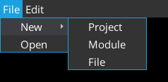
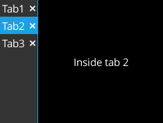
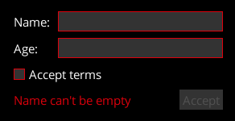
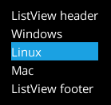

[](https://github.com/kotcrab/vis-ui)
[](https://search.maven.org/artifact/io.github.libktx/ktx-vis)

# KTX: VisUI type-safe builders

Utilities for creating [VisUI](https://github.com/kotcrab/vis-ui) widgets using Kotlin type-safe builders.

### Why?

While LibGDX layout managers are simple enough to use directly in Kotlin or Java, their usage usually leads to overly
verbose code. GUI layouts presented in HTML, XML and other readable markup languages are easier to reason about than
cluttered Java code. Fortunately, Kotlin [type-safe builders](https://Kotlinlang.org/docs/reference/type-safe-builders.html)
allow to write DSL that is both as readable as markup languages and as powerful as Java.

### Guide

This modules extends [`ktx-scene2d`](../scene2d), providing additional factory methods for the following VisUI widgets:

* *Root* actors:
  * `visDialog`
  * `visWindow`
  * `toastTable`
* *Parent* actors:
  * _Designed_ to store actors and control their layout:
    * `visTable`
    * `visTree`
    * `horizontalFlowGroup`
    * `verticalFlowGroup`
    * `gridGroup`
    * `floatingGroup`
    * `dragPane`
    * `visScrollPane`
    * `visSplitPane`
    * `multiSplitPane`
    * `collapsible`
    * `horizontalCollapsible`
  * _Can_ store actors due to type hierarchy:
    * `visTextButton`
    * `visImageButton`
    * `visImageTextButton`
    * `visCheckBox`
    * `visRadioButton`
    * `basicColorPicker`
    * `extendedColorPicker`
    * `spinner`
* *Child* actors:
  * `visLabel`
  * `linkLabel`
  * `visImage`
  * `visList`, `visListOf`
  * `visProgressBar`
  * `visSelectBox`, `visSelectBoxOf`
  * `visSlider`
  * `visTextArea`
  * `highlightTextArea`
  * `scrollableTextArea`
  * `visTextField`
  * `visValidatableTextField`
  * `busyBar`
  * `separator`
* Other widget managers:
  * `buttonBar`
  * `listView`
  * `tabbedPane`

Please refer to [`ktx-scene2d`](../scene2d) documentation for general info about GUI builders.

#### Tooltips

`ktx-vis` provides extension methods for creating VisUI tooltips:

```kotlin
import ktx.scene2d.scene2d
import ktx.scene2d.vis.*

val myLabel = scene2d.visLabel("Label with tooltip") {
  visTextTooltip("Tooltip text")
}
```

These methods include:

* `visTextTooltip` - adds simple text tooltip.
* `visTooltip` - adds tooltip with fully customized content.

#### Menus

`Menu` and `PopupMenu` instances are created in very similar way to UI layouts.

```kotlin
import com.badlogic.gdx.scenes.scene2d.Stage
import ktx.scene2d.scene2d
import ktx.scene2d.vis.*

fun createMenu(stage: Stage) {
  val menu = scene2d.popupMenu {
    menuItem("First Item")
    menuItem("Second Item")
    menuItem("Third Item") {
      subMenu {
        menuItem("SubMenu Item")
      }
    }
  }
  menu.showMenu(stage, 0f, 0f) 
}
```

See examples section for `MenuBar` usage.

#### Validation

* `validator` is an inlined function that allows to create and customize a VisUI `FormValidator`.
See usage examples for further details.

### Usage examples

Before using `ktx-vis`, make sure that the VisUI skin is loaded and set as the default skin:

```kotlin
import com.kotcrab.vis.ui.VisUI
import ktx.scene2d.Scene2DSkin

fun create() {
  VisUI.load()
  Scene2DSkin.defaultSkin = VisUI.getSkin()
}
```

Creating a `VisWindow`, immediately added to a `Stage`:

```kotlin
import com.badlogic.gdx.scenes.scene2d.Stage
import ktx.scene2d.actors
import ktx.scene2d.vis.*

fun createWindow(stage: Stage) {
  stage.actors {
    visWindow("Title") {
      isModal = true
      visLabel("Hello world!")
    }
  }
}
```

Creating a `MenuBar`:

```kotlin
import com.badlogic.gdx.Input
import com.badlogic.gdx.scenes.scene2d.Stage
import ktx.scene2d.actors
import ktx.scene2d.vis.*

fun createMenuBar(stage: Stage) {
  stage.actors {
    visTable {
      menuBar { cell ->
        cell.top().growX().expandY().row()
        menu("File") {
          menuItem("New") {
            subMenu {
              menuItem("Project")
              menuItem("Module")
              menuItem("File")
            }
          }
          menuItem("Open") { /**/ }
        }
        menu ("Edit") {
          menuItem("Undo") {
            setShortcut(Input.Keys.CONTROL_LEFT, Input.Keys.Z)
          }
          menuItem("Redo") { /**/ }
        }
      }
      setFillParent(true)
    }
  }
}
```



Creating a `ButtonGroup` with `VisRadioButton` instances:

```kotlin
import ktx.scene2d.buttonGroup
import ktx.scene2d.scene2d
import ktx.scene2d.vis.*

fun createMenuBar() =
  scene2d.buttonGroup(minCheckedCount = 1, maxCheckedCount = 2) {
    visRadioButton("First")
    visRadioButton("Second")
    visRadioButton("Third")
  }
```

Creating a `ButtonBar`:

```kotlin
import com.kotcrab.vis.ui.widget.ButtonBar.ButtonType
import ktx.scene2d.scene2d
import ktx.scene2d.vis.*

fun createButtonBar() =
  scene2d.buttonBar {
    setButton(ButtonType.APPLY, scene2d.visTextButton("Accept"))
    setButton(ButtonType.CANCEL, scene2d.visTextButton("Cancel"))
  }
```

Creating `Tree` of `Label` instances:

```kotlin
import ktx.scene2d.scene2d
import ktx.scene2d.vis.*

fun createTree() =
  scene2d.visTree {
    visLabel("Node")
    visLabel("Node")
    visLabel("Nest") { node ->
      node {
        visLabel("Nested") { node ->
          node.visLabel("Nested")
        }
        visLabel("Nested")
      }
    }
    visLabel("Node")
  }
```


Creating a `TabbedPane` with multiple tabs:

```kotlin
import ktx.scene2d.scene2d
import ktx.scene2d.vis.*

fun createTabbedPane() =
  scene2d.visTable {
    val pane = tabbedPane("vertical") { cell ->
      cell.growY()
      tab("Tab1") {
        visLabel("Inside tab 1")
      }
      tab("Tab2") {
        visLabel("Inside tab 2")
      }
      tab("Tab3") {
        visLabel("Inside tab 3")
      }
    }
    val container = visTable().cell(grow = true)
    pane.addTabContentsTo(container)
    pane.switchTab(0)

    setFillParent(true)
  }
```



Creating a form using `FormValidator`:

```kotlin
import com.badlogic.gdx.utils.Align
import ktx.scene2d.scene2d
import ktx.scene2d.vis.*

fun createValidator() =
  scene2d.visTable(defaultSpacing = true) {
    validator {
      defaults().left()

      visLabel("Name: ")
      notEmpty(visValidatableTextField().cell(grow = true), "Name can't be empty")
      row()

      visLabel("Age: ")
      val ageField = visValidatableTextField().cell(grow = true)
      notEmpty(ageField, "Age can't be empty")
      integerNumber(ageField, "Age must be number")
      valueGreaterThan(ageField, "You must be at least 18 years old", 18f, true)
      row()

      checked(visCheckBox("Accept terms").cell(colspan = 2), "You must accept terms")
      row()

      setMessageLabel(visLabel("").cell(minWidth = 200f))
      addDisableTarget(visTextButton("Accept").cell(align = Align.right))
    }
    pack()
  }
```



Creating a `ListView`:

```kotlin
import com.badlogic.gdx.utils.Array as GdxArray
import com.kotcrab.vis.ui.util.adapter.AbstractListAdapter.SelectionMode
import com.kotcrab.vis.ui.util.adapter.SimpleListAdapter
import ktx.scene2d.scene2d
import ktx.scene2d.vis.*

fun createValidator() =
  scene2d.visTable(defaultSpacing = true) {
    val osList = GdxArray<String>()
    osList.add("Windows")
    osList.add("Linux")
    osList.add("Mac")

    val adapter = SimpleListAdapter(osList)
    adapter.selectionMode = SelectionMode.SINGLE
    listView(adapter) {
      header = visLabel("ListView header")
      footer = visLabel("ListView footer")
    }

    pack()
  }
```



#### Synergy

Consider using [`ktx-actors`](../actors) module to improve event handling with lambda-friendly extension methods like
`onChange` and `onClick`, as well as other general Scene2D extensions.

[`ktx-assets`](../assets) might help with UI resources management.

[`ktx-vis-style`](../vis-style) adds DSL for defining custom VisUI widget styles.

### Migration guide

Since `1.9.10-b6`, `ktx-vis` extends the [`ktx-scene2d`](../scene2d) module. If you are migrating from a previous
`ktx-vis` version, see the `ktx-scene2d` migration guide first.

Additionally to changes that apply to `ktx-scene2d`, `ktx-vis` was rewritten to match the `ktx-scene2d` API.
Notable changes include:

* All factory methods for VisUI widgets are now inlined.
* `vis` prefix was added to the names of some VisUI widget factory methods to avoid clashes with Scene2D 
and better reflect the widget class names. A complete list is available in the change log. 
* Parental actors including `collapsible`, `dragPane`, `horizontalCollapsible`, `visScrollPane`, `visSplitPane` and
`multiSplitPane` now do not require passing widgets to their factory methods. Instead, widgets are either automatically
created or can be defined as nested children with the same DSL.
* `DEFAULT_STYLE` constant is removed in favor of `defaultStyle` from `ktx-scene2d`.
* `styleName` parameters in factory methods were renamed to `style` for consistency with `ktx-scene2d`.
* `@VisDsl` DSL marker is replaced with `@Scene2dDsl` marker from `ktx-scene2d`.

Since `ktx-vis` required a complete rewrite and had to match `ktx-scene2d` API, there is no intermediate version with
deprecated methods. All legacy APIs were removed in `1.9.10-b6`. Please refer to the [change log](../CHANGELOG.md)
for a complete list of changes.

### Alternatives

- Creating layouts with [VisUI](https://github.com/kotcrab/vis-editor/wiki/VisUI) directly in Kotlin or Java.
- [LibGDX Markup Language](https://github.com/czyzby/gdx-lml/tree/master/lml) allows to build `Scene2D` views using
HTML-like syntax. It also features a [VisUI extension](https://github.com/czyzby/gdx-lml/tree/master/lml-vis). However,
it lacks first-class Kotlin support and the flexibility of a powerful programming language.

#### Additional documentation

- [VisUI wiki.](https://github.com/kotcrab/vis-editor/wiki/VisUI)
- [Scene2D article.](https://github.com/libgdx/libgdx/wiki/Scene2d)
- [Scene2D UI article.](https://github.com/libgdx/libgdx/wiki/Scene2d.ui)
- [`Table` article.](https://github.com/libgdx/libgdx/wiki/Table)
